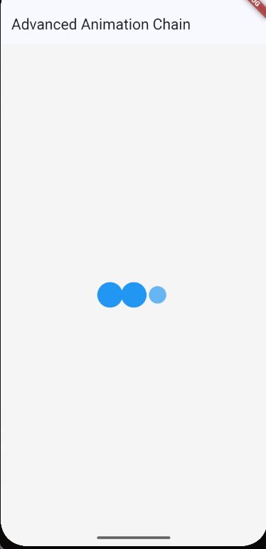

# Advanced Animation Chain - Flutter Loading Dots

A Flutter project demonstrating an advanced animation chain with sequential loading dots that scale and fade in a smooth, continuous loop.

## ✨ Features

- **Sequential Animation**: Three dots animate one after another in a continuous sequence
- **Dual Animation Effects**: Each dot combines both scale and opacity animations
- **Smooth Transitions**: Uses `Curves.easeInOut` for natural, fluid motion
- **Clean Design**: Simple blue circular dots without shadows for a modern look
- **Optimized Performance**: Proper `AnimationController` management with disposal
- **Responsive Layout**: Centered design that works on all screen sizes

## 🎯 Animation Details

### Animation Flow:
1. **Dot 1**: Scales from 0.5x to 1.5x while fading from 30% to 100% opacity
2. **Dot 2**: Follows the same pattern with a 0.3-second delay
3. **Dot 3**: Completes the sequence with another 0.3-second delay
4. **Loop**: Animation repeats continuously every 1.2 seconds

### Technical Implementation:
- **Duration**: 1200ms total cycle
- **Curves**: `Curves.easeInOut` for smooth transitions
- **Colors**: Blue theme with three shades (Blue, BlueAccent, LightBlue)
- **Size**: 20x20px dots with 8px horizontal spacing

## 📱 Preview

*The loading animation shows three blue dots scaling and fading in sequence*

## 🚀 Getting Started

### Prerequisites
- Flutter SDK installed
- Dart SDK
- Android Studio / VS Code with Flutter extensions

### Installation
1. Clone the repository
2. Navigate to the project directory
3. Run `flutter pub get` to install dependencies
4. Run `flutter run` to start the application

### Usage
The animation starts automatically when the app launches and runs continuously. The loading dots demonstrate advanced animation techniques including:
- Multiple `Tween` animations
- `AnimationController` with `TickerProviderStateMixin`
- Sequential timing with `Interval` curves
- Proper resource disposal

## 📚 Learning Objectives

This project demonstrates:
- Advanced Flutter animation concepts
- `AnimationController` lifecycle management
- Creating complex animation sequences
- Using `Tween` and `CurvedAnimation`
- Building reusable animated widgets
- Proper animation disposal and memory management

## 🎨 Customization

You can easily customize the animation by modifying:
- **Speed**: Change `animationDuration` value
- **Colors**: Update the colors array in `_getDotColor()`
- **Size**: Modify container width/height
- **Timing**: Adjust the `startTime` intervals
- **Curves**: Experiment with different `Curves` values

